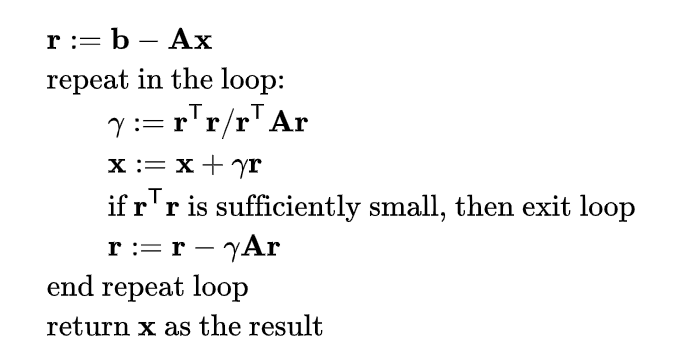
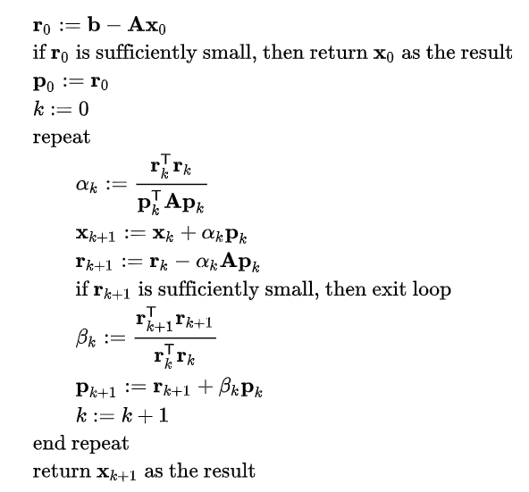

# Simple Steppest descent and gradient problem

Dependencies `python >= 3.9`, `numpy` and `matplotlib`

Execute using:
```shell
python3 gradients.py
```

The script implements simple Steppest descent algorithm as well as the
conjugate gradient.

Two approaches are proposed:
* Steppest descent as first method to solve the poisson problem. 
The algorithm is based on a Taylor expansion of second order, and holds quadratric convergence within the convergence region.
It's main drawback is on the number of iterations required to reach convergence, because the selected directions can be repeated at each step.



* Conjugate Gradient as a second attempt, which forced descent by using an Arnoldi procedure, it guaratees minimal amount of descent diretions.
Relative convergence is guarateed and suitable option when the system is positive definite. As its name refer, it uses a conjugate property of
the matrix-product operation `Ax` induces a suitable dot product `<Ax, y>` creating a base for the solution through Krylov Spaces.



TODOS:
- [ ] Benchmark against analytical solution.
- [ ] Simple test comparing steppest descent vs gradient descent.
- [ ] Test case with multiple sine, cosine functions.
- [ ] Mesh convergence analysis
